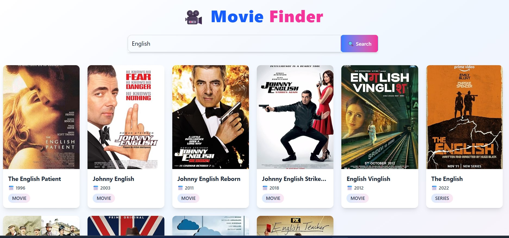

# 🎬 Movie Finder App

A simple and responsive **Movie Finder Web App** built with **React + Vite + Tailwind CSS**.  
This app uses the **IMDb API** to fetch movie details and provides direct links for all searched movies.

---

## 🚀 Features
- 🔍 Search any movie by name  
- 🎥 Fetches real-time data from IMDb API  
- 🌐 Provides direct clickable links to movie pages  
- 📱 Fully responsive design (mobile, tablet, desktop)  
- 🎨 Styled with **Tailwind CSS**  
- ⚡ Built with **React + Vite** for fast performance  

---

## 🖼️ Preview
Here’s a screenshot of the app:



---

## 🛠️ Tech Stack
- **React** (Frontend library)  
- **Vite** (Development & build tool)  
- **Tailwind CSS** (Styling)  
- **IMDb API** (Movie data)  

---

## 📂 Project Setup

### 1️⃣ Clone the repository
```bash
git clone https://github.com/your-username/movie-finder.git
cd movie-finder
2️⃣ Install dependencies
bash
Copy code
npm install
3️⃣ Start the development server
bash
Copy code
npm run dev
4️⃣ Build for production
bash
Copy code
npm run build
🔑 API Setup
Get your IMDb API key from IMDb API

Create a .env file in the project root and add:

env
Copy code
VITE_IMDB_API_KEY=your_api_key_here
📌 Usage
Enter any movie name in the search bar

Browse through search results

Click on a movie title to open its IMDb link

🤝 Contributing
Pull requests are welcome. For major changes, please open an issue first to discuss what you’d like to change.

